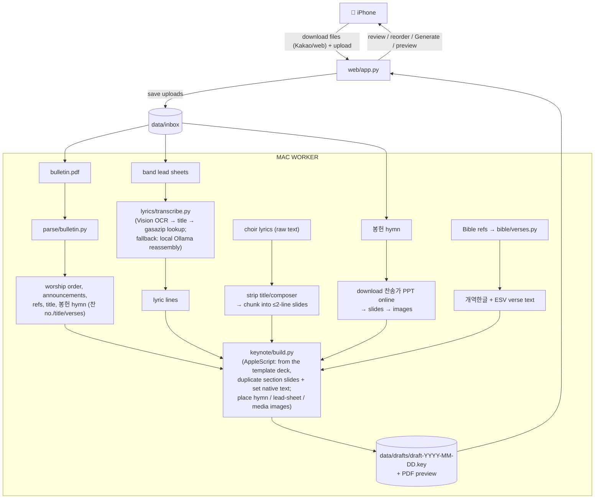

# Worship Deck Builder

Automates the weekly update of the Keynote deck used in a Korean church's Sunday worship
service. The same deck is shared across all services (e.g. 9am and 11am).

Each week the deck is rebuilt from a template using:
- the weekly **bulletin PDF** (worship order, announcements, Bible references, sermon title,
  and the 봉헌 offering-hymn 찬송가 number/title/verses),
- **worship-band lead sheets** (images shared via Kakao) — often a multi-song medley with
  red arrangement marks (section order, ×N repeats, X-out skips, → segues); only the
  **lyrics** are needed, since the band runs the arrangement live from the sheets. Each
  sheet's title is detected from the OCR and canonical lyrics are fetched from
  gasazip.com, falling back to a free local OCR + LLM hybrid when no confident match,
- **성가대 choir lyrics** as raw text (pasted into the review app),
- **봉헌 (offering) hymn slides** downloaded online as a 찬송가 PowerPoint per song,
- occasional **last-minute text updates**.

The tool produces a **draft deck for human review** — it never auto-publishes.

## The one hard constraint: a Mac must be on

Native Keynote can only be driven on a Mac that is **powered on and logged in** (Keynote
automation needs the macOS window server). So:

- **The Mac is the worker** — it runs Keynote and builds the deck.
- **Phones are the remote** — a small **mobile web app**, reached privately over a
  **Tailscale** tailnet (stable MagicDNS hostname, HTTPS via `tailscale serve`), lets
  whoever is on duty **upload the week's files**, review/reorder songs, tap *Generate*,
  and later tweak the built deck in Keynote on iPhone.

To run while away, the Mac must stay **awake** (`caffeinate`/`pmset`) and **on the
tailnet**. See [Remote access & deployment](#remote-access--deployment) for the full plan.

## Architecture



Key insight: the congregation-facing slides (intro/ending date, Bible verses, worship
lyrics, announcements) are **native Keynote text boxes**, so the builder edits their text
in place — setting text runs and duplicating slides as sections expand — rather than
rendering images. The only image slides are 봉헌 (offering) hymn pages (downloaded online
as a 찬송가 PowerPoint per song, converted to images), band lead sheets, and media; these
are placed as-is.

## Slide map

See [`config/slide_map.yaml`](config/slide_map.yaml) — it encodes which template sections
change weekly and where their content comes from.

### Replacing the template (`master.key`) — maintenance checklist

`master.key` is a real recent deck, so it's replaced occasionally (a new seasonal design, a
re-ordered service). The build does **not** hard-code section slide indices: at build time it
dumps every slide's text once and derives each section's anchor and size from the deck's
landmark text ([#98](../../issues/98)) — the recurring divider headings (예배의 부름 /
고백의 찬양 / 사도신경 / 성가대 찬양 / 봉 헌 / 교회 소식), the `[<ref>, 개역한글]` verse-label
slides, and the 파송의 노래/축도/주기도문 closing (see `keynote/anchors.py`; reference
positions are documented in `config/slide_map.yaml`). A new template that keeps these
landmarks needs **no code changes**; one that breaks a landmark makes the build **fail loudly
before touching any slide** instead of silently editing the wrong ones.

So after dropping in a new `master.key`, just verify detection on it:

```bash
TEMPLATE_KEY=templates/master.key pytest -m local_only -k detect_anchors_live
```

If it fails, the error names the section whose landmark is missing/ambiguous — fix the deck
(restore the landmark slide) or extend the detection rules in `keynote/anchors.py`, then do an
eyeball build to confirm. Refreshing `tests/fixtures/master_slide_texts.json` (a sanitized
`dump_slide_texts` output — scrub member names first) is only needed when the structure
changed enough that the CI tests' reference map should follow.

## Setup

**System prerequisites (macOS):**

- **Python 3.11+** (system Python 3.9 is too old; install via Homebrew).
- **Keynote** installed, with Terminal/automation permission granted to control it.
- **Xcode Command Line Tools** — `xcode-select --install`. Provides `swift`, used for the
  Apple Vision OCR step (`src/worship_deck/lyrics/ocr_ko.swift`).
- **Ollama** running locally, for the lyric-reassembly fallback when a sheet's song
  isn't matched on gasazip.com (free, offline — no API key):

  ```bash
  brew install ollama
  ollama serve                 # leave running (or: brew services start ollama)
  ollama pull qwen3:14b        # ~9 GB; the default model for both lyric tasks
  ```

- **LibreOffice + poppler**, for converting the downloaded 봉헌 hymn PowerPoint to slide
  PNGs (`brew install --cask libreoffice && brew install poppler`).
- **Tailscale** for reaching the web app from phones while away — see
  [Remote access & deployment](#remote-access--deployment).

**Install and configure:**

```bash
pip install -e ".[dev]"
cp .env.example .env          # then fill in the values below
```

Fill in `.env` (git-ignored):

| Variable | What to set |
|----------|-------------|
| `ESV_API_KEY` | Free non-commercial key from [api.esv.org](https://api.esv.org/) — English verse text. |
| `TEMPLATE_KEY` | Path to the master Keynote template deck (`templates/master.key`; git-ignored, place locally). |
| `OLLAMA_MODEL` / `OLLAMA_HOST` | One model for both lyric tasks (reassembly + line splitting) + Ollama address. Defaults (`qwen3:14b`, `http://127.0.0.1:11434`) work out of the box. |
| `WEB_HOST` / `WEB_PORT` | Web app bind address (defaults `127.0.0.1:8787`). Keep it on loopback in production — `tailscale serve` provides remote access; see [Remote access & deployment](#remote-access--deployment). |
| `NTFY_TOPIC` | *(optional)* [ntfy.sh](https://ntfy.sh/) topic for phone push on failure — leave blank to disable. |

No Anthropic/cloud key is needed — worship-song lyrics are fetched from gasazip.com (no
key, no account) or transcribed fully locally on fallback. 봉헌 (offering) hymn slides are
downloaded online per song, so there is no local hymn directory to configure.

## Remote access & deployment

The app is reachable from phones **privately over [Tailscale](https://tailscale.com)** and
is **never exposed to the public internet** (it handles member names + offering amounts).
This is a v2 effort tracked in issues [#148–#162](../../issues?q=label%3Av2); the access
model is **locked on Tailscale** — chosen over a Cloudflare tunnel because it is $0 with no
domain, keeps traffic off the public internet entirely, and is the simplest to hand off.

- **Network.** Every operator joins one tailnet. The Mac gets a stable **MagicDNS**
  hostname and serves the app over HTTPS via `tailscale serve` — no port-forwarding and no
  open firewall ports. uvicorn binds **loopback only** (`127.0.0.1`); the tailnet is the
  only way in.
- **Identity.** There is no app password — the tailnet authenticates each user, and the
  app reads Tailscale Serve's identity headers (`Tailscale-User-Login`) to attribute each
  run to a member.
- **Onboarding.** Non-technical church members install Tailscale once (with a guide/video)
  and add the app to their home screen; thereafter it's a single tap.
- **Always-on host.** The production target is a church **Mac mini** that stays powered on,
  awake (`caffeinate`/`pmset`), and on the tailnet across reboots, with the web app and
  Tailscale auto-starting via `launchd`.

Tailnet ownership starts on a personal account and will be **transferred to the church's
account later** (promote it to Owner on the *same* tailnet — never create a new tailnet, or
every device must re-authenticate).

## Privacy

This handles **church members' data** — offering amounts, names, and private chat messages.
`data/` is git-ignored and **nothing under it is ever committed** — no real church data (offering amounts, names, or private messages) lives in this repository.
