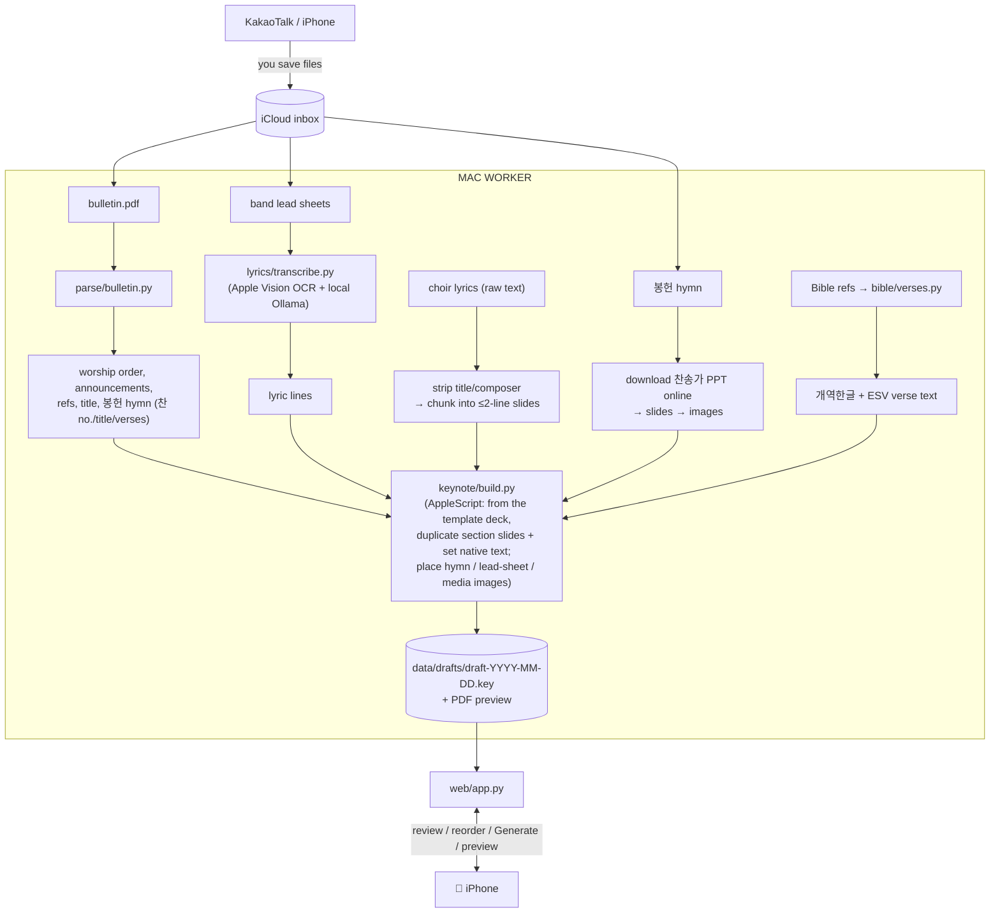

# Worship Deck Builder

Automates the weekly update of the Keynote deck used in a Korean church's Sunday worship
service. The same deck is shared across all services (e.g. 9am and 11am).

Each week the deck is rebuilt from a template using:
- the weekly **bulletin PDF** (worship order, announcements, Bible references, sermon title,
  and the 봉헌 offering-hymn 찬송가 number/title/verses),
- **worship-band lead sheets** (images shared via Kakao) — often a multi-song medley with
  red arrangement marks (section order, ×N repeats, X-out skips, → segues); only the
  **lyrics** are transcribed (a free local OCR + LLM hybrid), since the band runs the
  arrangement live from the sheets,
- **성가대 choir lyrics** as raw text (pasted into the review app),
- **봉헌 (offering) hymn slides** downloaded online as a 찬송가 PowerPoint per song,
- occasional **last-minute text updates**.

The tool produces a **draft deck for human review** — it never auto-publishes.

## The one hard constraint: a Mac must be on

Native Keynote can only be driven on a Mac that is **powered on and logged in** (Keynote
automation needs the macOS window server). So:

- **The Mac is the worker** — it runs Keynote and builds the deck.
- **Your iPhone is the remote** — files arrive via an **iCloud drop-folder**, and a small
  **mobile web app** (reached privately over Tailscale) lets you review/reorder songs and
  tap *Generate*.

To run while away, the Mac must stay awake (scheduled wake / Tailscale wake-on-LAN).

## Architecture



Key insight: the congregation-facing slides (intro/ending date, Bible verses, worship
lyrics, announcements) are **native Keynote text boxes**, so the builder edits their text
in place — setting text runs and duplicating slides as sections expand — rather than
rendering images. The only image slides are 봉헌 (offering) hymn pages (downloaded online
as a 찬송가 PowerPoint per song, converted to images), band lead sheets, and media; these
are placed as-is.

## Slide map

See [`config/slide_map.yaml`](config/slide_map.yaml) — it encodes which template sections
change weekly and where their content comes from.

## Setup

**System prerequisites (macOS):**

- **Python 3.11+** (system Python 3.9 is too old; install via Homebrew).
- **Keynote** installed, with Terminal/automation permission granted to control it.
- **Xcode Command Line Tools** — `xcode-select --install`. Provides `swift`, used for the
  Apple Vision OCR step (`src/worship_deck/lyrics/ocr_ko.swift`).
- **Ollama** running locally, for lyric reassembly (free, offline — no API key):

  ```bash
  brew install ollama
  ollama serve                 # leave running (or: brew services start ollama)
  ollama pull qwen3.5:27b      # 17 GB; best quality. Lighter: exaone3.5:7.8b (4.8 GB)
  ```

- **Tailscale** for reaching the mobile web app from your phone while away.

**Install and configure:**

```bash
pip install -e ".[dev]"
cp .env.example .env          # then fill in the values below
```

Fill in `.env` (git-ignored):

| Variable | What to set |
|----------|-------------|
| `ESV_API_KEY` | Free non-commercial key from [api.esv.org](https://api.esv.org/) — English verse text. |
| `INBOX_DIR` | Drop folder for the weekly bulletin PDF + sheet images (default: an iCloud Drive path). |
| `TEMPLATE_KEY` | Path to the master Keynote template deck (`templates/master.key`; git-ignored, place locally). |
| `OLLAMA_MODEL` / `OLLAMA_HOST` | Lyric-reassembly model + Ollama address. Defaults (`qwen3.5:27b`, `http://127.0.0.1:11434`) work out of the box. |
| `WEB_HOST` / `WEB_PORT` | Mobile review/trigger web app bind address (defaults `127.0.0.1:8787`). |
| `NTFY_TOPIC` | *(optional)* [ntfy.sh](https://ntfy.sh/) topic for phone push on failure — leave blank to disable. |

No Anthropic/cloud key is needed — lyric transcription is fully local. 봉헌 (offering) hymn
slides are downloaded online per song, so there is no local hymn directory to configure.

## Privacy

This handles **church members' data** — offering amounts, names, and private chat messages.
`data/` is git-ignored and **nothing under it is ever committed** — no real church data (offering amounts, names, or private messages) lives in this repository.
