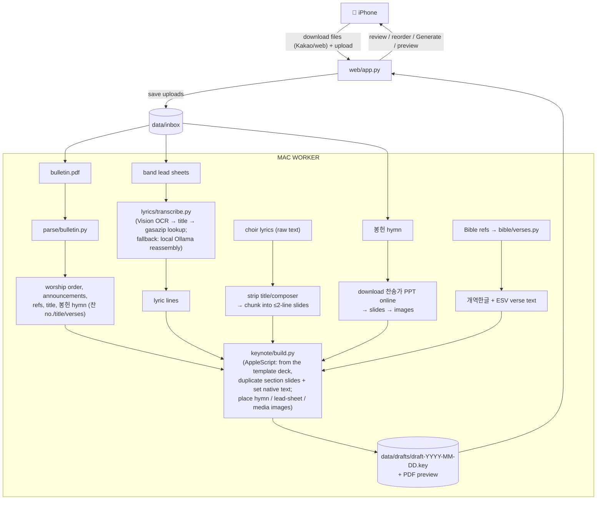

# Worship Deck Builder

Automates the weekly update of the Keynote deck used in a Korean church's Sunday worship
service. The same deck is shared across all services (e.g. 9am and 11am).

Each week the deck is rebuilt from a template using:
- the weekly **bulletin PDF** (worship order, announcements, Bible references, sermon title,
  and the 봉헌 offering-hymn 찬송가 number/title/verses),
- **worship-band lead sheets** (images shared via Kakao) — often a multi-song medley with
  red arrangement marks (section order, ×N repeats, X-out skips, → segues); only the
  **lyrics** are needed, since the band runs the arrangement live from the sheets. Each
  sheet's title is detected from the OCR and canonical lyrics are fetched from
  gasazip.com, falling back to a free local OCR + LLM hybrid when no confident match,
- **성가대 choir lyrics** as raw text (pasted into the review app),
- **봉헌 (offering) hymn slides** downloaded online as a 찬송가 PowerPoint per song,
- occasional **last-minute text updates**.

The tool produces a **draft deck for human review** — it never auto-publishes.

## The one hard constraint: a Mac must be on

Native Keynote can only be driven on a Mac that is **powered on and logged in** (Keynote
automation needs the macOS window server). So:

- **The Mac is the worker** — it runs Keynote and builds the deck.
- **Your iPhone is the remote** — a small **mobile web app** (reached privately over
  Tailscale) lets you **upload the week's files**, review/reorder songs, and tap *Generate*.

To run while away, the Mac must stay awake (scheduled wake / Tailscale wake-on-LAN).

## Architecture



Key insight: the congregation-facing slides (intro/ending date, Bible verses, worship
lyrics, announcements) are **native Keynote text boxes**, so the builder edits their text
in place — setting text runs and duplicating slides as sections expand — rather than
rendering images. The only image slides are 봉헌 (offering) hymn pages (downloaded online
as a 찬송가 PowerPoint per song, converted to images), band lead sheets, and media; these
are placed as-is.

## Slide map

See [`config/slide_map.yaml`](config/slide_map.yaml) — it encodes which template sections
change weekly and where their content comes from.

### Replacing the template (`master.key`) — maintenance checklist

`master.key` is a real recent deck, so it's replaced occasionally (a new seasonal design, a
re-ordered service). The build locates each section by a **hard-coded slide index** that is
true only for the *current* template. A new deck almost certainly shifts these, and the build
will then edit/delete the wrong slides **with no error**. So after dropping in a new
`master.key`, re-verify every anchor below and update both `keynote/build.py` and
`config/slide_map.yaml` (they must agree). This is rare but mandatory — there is no automatic
drift handling yet ([#98](../../issues/98)).

The anchors (1-based slide numbers), as called in `build()`:

| Section | Anchor(s) in `build.py` | Notes |
|---|---|---|
| 찬양 worship medley | `fill_worship_songs(…, 6, 41, …)` | start slide 6, section length 41 |
| 예배의 부름 verses | `fill_verse_slides(…, 48, …, existing_count=1)` | |
| 고백의 찬양 | `fill_confession_slides(…, 57, …)` | divider 57; title banner 59 + lyrics 60–67 (`existing_lyric_count=8` in the fn defaults) |
| 성가대 choir | `fill_choir_slides(…, 77, …)` | also `title_count=2`, `existing_lyric_count=17` in the fn defaults |
| 봉헌 hymn images | `fill_hymn_slides(…, 97, …)` | start slide only; the block size is detected at runtime |
| 교회소식 announcements | `fill_announcement_slides(…, 117, …, existing_count=5)` | |
| 말씀 verses | `fill_verse_slides(…, 129, …, existing_count=4)` | |
| 말씀 title slide | `set_sermon_title_slide(…, 134, …)` | |
| 말씀 ad-hoc special block | `delete_slides(…, 135, 18)` | **most fragile** — 18 ad-hoc slides between the title and the 파송/축도/주기도문 closing; size + content vary every week ([#97](../../issues/97)) |

**How to find the new numbers** — open the new `master.key` in Keynote and read the slide
positions from the navigator, or decode the deck without Keynote (the `.key` is a Zip of
Snappy-framed protobuf; unzip `Index/Slide-*.iwa`, decompress each Snappy block, and the
Korean text survives in the literals — enough to map slide → section). For the special block:
its range is everything between the sermon-title slide and the first recurring-closing slide
(파송의 노래 / 축도 / 주기도문). Update `existing_count` / `section_len` arguments too if the
template's per-section slide counts changed.

After updating, run `pytest -m "not local_only" tests/test_keynote_build.py` (the `build`
dispatch test pins the anchors) and do an eyeball build to confirm.

## Setup

**System prerequisites (macOS):**

- **Python 3.11+** (system Python 3.9 is too old; install via Homebrew).
- **Keynote** installed, with Terminal/automation permission granted to control it.
- **Xcode Command Line Tools** — `xcode-select --install`. Provides `swift`, used for the
  Apple Vision OCR step (`src/worship_deck/lyrics/ocr_ko.swift`).
- **Ollama** running locally, for the lyric-reassembly fallback when a sheet's song
  isn't matched on gasazip.com (free, offline — no API key):

  ```bash
  brew install ollama
  ollama serve                 # leave running (or: brew services start ollama)
  ollama pull qwen3:14b        # ~9 GB; the default model for both lyric tasks
  ```

- **LibreOffice + poppler**, for converting the downloaded 봉헌 hymn PowerPoint to slide
  PNGs (`brew install --cask libreoffice && brew install poppler`).
- **Tailscale** for reaching the mobile web app from your phone while away.

**Install and configure:**

```bash
pip install -e ".[dev]"
cp .env.example .env          # then fill in the values below
```

Fill in `.env` (git-ignored):

| Variable | What to set |
|----------|-------------|
| `ESV_API_KEY` | Free non-commercial key from [api.esv.org](https://api.esv.org/) — English verse text. |
| `TEMPLATE_KEY` | Path to the master Keynote template deck (`templates/master.key`; git-ignored, place locally). |
| `OLLAMA_MODEL` / `OLLAMA_HOST` | One model for both lyric tasks (reassembly + line splitting) + Ollama address. Defaults (`qwen3:14b`, `http://127.0.0.1:11434`) work out of the box. |
| `WEB_HOST` / `WEB_PORT` | Mobile review/trigger web app bind address (defaults `127.0.0.1:8787`). |
| `NTFY_TOPIC` | *(optional)* [ntfy.sh](https://ntfy.sh/) topic for phone push on failure — leave blank to disable. |

No Anthropic/cloud key is needed — worship-song lyrics are fetched from gasazip.com (no
key, no account) or transcribed fully locally on fallback. 봉헌 (offering) hymn slides are
downloaded online per song, so there is no local hymn directory to configure.

## Privacy

This handles **church members' data** — offering amounts, names, and private chat messages.
`data/` is git-ignored and **nothing under it is ever committed** — no real church data (offering amounts, names, or private messages) lives in this repository.
