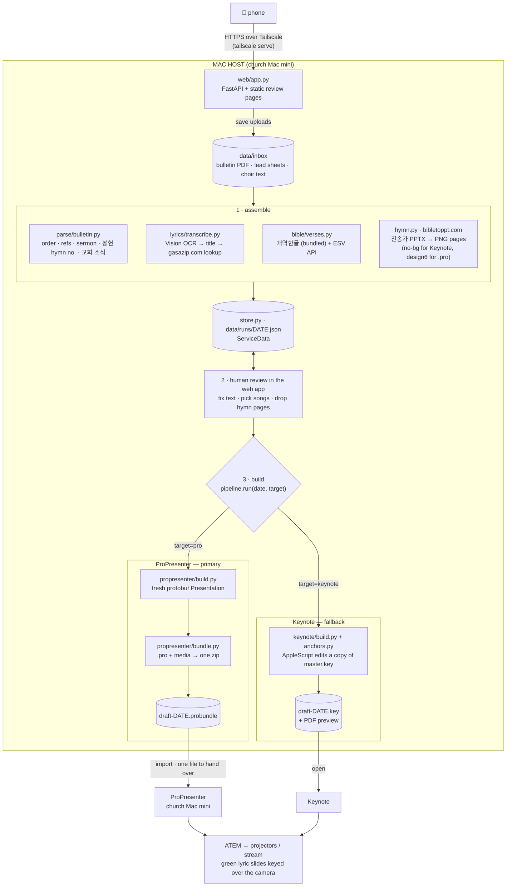

# Worship Deck Builder

Automates the weekly worship deck for a Korean church's Sunday services. The same deck is shared
across all services (e.g. 9am and 11am).

Each week the deck is rebuilt from:
- the weekly **bulletin PDF** (worship order, announcements, Bible references, sermon title,
  and the 봉헌 offering-hymn 찬송가 number/title/verses),
- **worship-band lead sheets** (images shared via Kakao) — often a multi-song medley with
  red arrangement marks (section order, ×N repeats, X-out skips, → segues); only the
  **lyrics** are needed, since the band runs the arrangement live from the sheets. Each
  sheet's title is detected from the OCR and canonical lyrics are fetched from
  gasazip.com; when no match is confident, the operator picks one of the scored candidates
  in review,
- **성가대 choir lyrics** as raw text (pasted into the review app),
- **봉헌 (offering) hymn slides** downloaded online as a 찬송가 PowerPoint per song,
- occasional **last-minute text updates**.

The same reviewed data can be built two ways — the review page has one button per target:

- **ProPresenter 덱** *(primary)* — a ground-up ProPresenter `.pro`, packed with its media into
  a single **`.probundle`** that the operator imports on the church Mac. Takes seconds.
- **Keynote 덱** *(fallback)* — the original Keynote `.key`, built by editing a copy of the
  church's template deck. Stays working until the ProPresenter cutover is complete
  ([#184](../../issues/184)).

The tool produces a **draft deck for human review** — it never auto-publishes.

## What needs a Mac

A **Mac is the host**: it runs the web app, Apple Vision OCR on the lead sheets (assemble),
and opens the finished deck. Phones are the remote — a small **mobile web app**, reached
privately over a **Tailscale** tailnet (stable MagicDNS hostname, HTTPS via
`tailscale serve`), lets whoever is on duty **upload the week's files**, review/reorder songs,
and tap a build button.

The two build targets differ in what they need from that Mac:

| | ProPresenter (`.pro`) | Keynote (`.key`) |
|---|---|---|
| How it builds | pure-Python protobuf serialization | AppleScript driving Keynote |
| Needs | the generated protobuf bindings (dev setup, below) | Keynote + a **logged-in GUI session** (Keynote automation needs the macOS window server) |
| Time | ~2s | ~60–90s |
| Output | `data/drafts/draft-YYYY-MM-DD.probundle` | `data/drafts/draft-YYYY-MM-DD.key` + PDF preview |

To run while away, the Mac must stay **awake** (`caffeinate`/`pmset`) and **on the
tailnet**. See [Remote access & deployment](#remote-access--deployment) for the full plan.

## Architecture


```mermaid
flowchart TD
    phone["📱 phone"] -->|"HTTPS over Tailscale<br/>(tailscale serve)"| web

    subgraph mac ["MAC HOST (church Mac mini)"]
        direction TB
        web["web/app.py<br/>FastAPI + static review pages"]
        inbox[("data/inbox<br/>bulletin PDF · lead sheets · choir text")]

        subgraph assemble ["1 · assemble"]
            direction TB
            parse["parse/bulletin.py<br/>order · refs · sermon · 봉헌 hymn no. · 교회 소식"]
            lyr["lyrics/transcribe.py<br/>Vision OCR → title → gasazip.com lookup"]
            bib["bible/verses.py<br/>개역한글 (bundled) + ESV API"]
            hym["hymn.py · bibletoppt.com<br/>찬송가 PPTX → PNG pages<br/>(no-bg for Keynote, design6 for .pro)"]
        end

        store[("store.py · data/runs/DATE.json<br/>ServiceData")]
        review["2 · human review in the web app<br/>fix text · pick songs · drop hymn pages"]
        run{"3 · build<br/>pipeline.run(date, target)"}

        subgraph pro ["ProPresenter — primary"]
            direction TB
            pbuild["propresenter/build.py<br/>fresh protobuf Presentation"]
            pbundle["propresenter/bundle.py<br/>.pro + media → one zip"]
            pout[("draft-DATE.probundle")]
            pbuild --> pbundle --> pout
        end

        subgraph key ["Keynote — fallback"]
            direction TB
            kbuild["keynote/build.py + anchors.py<br/>AppleScript edits a copy of master.key"]
            kout[("draft-DATE.key<br/>+ PDF preview")]
            kbuild --> kout
        end

        web -->|"save uploads"| inbox
        inbox --> assemble
        assemble --> store
        store <--> review
        review --> run
        run -->|"target=pro"| pbuild
        run -->|"target=keynote"| kbuild
    end

    pout -->|"import · one file to hand over"| pp["ProPresenter<br/>church Mac mini"]
    kout -->|"open"| kn["Keynote"]
    pp --> atem["ATEM → projectors / stream<br/>green lyric slides keyed over the camera"]
    kn --> atem
```

Both builders write **native, editable text** — Keynote text boxes set in place, and
ProPresenter RTF text elements serialized from scratch — never rendered images. The only
image slides are the 봉헌 (offering) hymn pages (downloaded online as a 찬송가 PowerPoint per
song, converted to images) and the deck's own artwork and media. Where they differ is where
the look comes from: the Keynote builder inherits it from the template deck and edits a copy;
the ProPresenter builder has no template and bakes the look from code
(`src/worship_deck/propresenter/styles.py`).

**How the ProPresenter path works** — the protobuf toolchain, the generation flow, and what's
inside a `.pro` — is diagrammed in
[`docs/propresenter-architecture.md`](docs/propresenter-architecture.md). The reasoning behind
it is in [`docs/propresenter-generator-design.md`](docs/propresenter-generator-design.md).

## Keynote template (fallback path only)

### Slide map

See [`config/slide_map.yaml`](config/slide_map.yaml) — it encodes which template sections
change weekly and where their content comes from.

### Replacing the template (`master.key`) — maintenance checklist

`master.key` is a real recent deck, so it's replaced occasionally (a new seasonal design, a
re-ordered service). The build does **not** hard-code section slide indices: at build time it
dumps every slide's text once and derives each section's anchor and size from the deck's
landmark text ([#98](../../issues/98)) — the recurring divider headings (예배의 부름 /
고백의 찬양 / 사도신경 / 성가대 찬양 / 봉 헌 / 교회 소식), the `[<ref>, 개역한글]` verse-label
slides, and the 파송의 노래/축도/주기도문 closing (see `keynote/anchors.py`; reference
positions are documented in `config/slide_map.yaml`). A new template that keeps these
landmarks needs **no code changes**; one that breaks a landmark makes the build **fail loudly
before touching any slide** instead of silently editing the wrong ones.

So after dropping in a new `master.key`, just verify detection on it:

```bash
TEMPLATE_KEY=templates/master.key pytest -m local_only -k detect_anchors_live
```

If it fails, the error names the section whose landmark is missing/ambiguous — fix the deck
(restore the landmark slide) or extend the detection rules in `keynote/anchors.py`, then do an
eyeball build to confirm. Refreshing `tests/fixtures/master_slide_texts.json` (a sanitized
`dump_slide_texts` output — scrub member names first) is only needed when the structure
changed enough that the CI tests' reference map should follow.

The ProPresenter build has no template: its service order is the sequence of `fill_*` calls in
`propresenter/build.py`, and its fixed wording lives in `propresenter/content.py`.

## Setup

**System prerequisites (macOS):**

- **Python 3.11+** (system Python 3.9 is too old; install via Homebrew).
- **Xcode Command Line Tools** — `xcode-select --install`. Provides `swift`, used for the
  Apple Vision OCR step (`src/worship_deck/lyrics/ocr_ko.swift`) and the `.pro` text-fit
  audit (`scripts/audit_pro_layout.py`).
- **LibreOffice + poppler**, for converting the downloaded 봉헌 hymn PowerPoint to slide
  PNGs (`brew install --cask libreoffice && brew install poppler`).
- **protoc** (`brew install protobuf`), for the ProPresenter build — it generates the Python
  protobuf bindings, which are **git-ignored**, so run `scripts/gen_proto.sh` after every
  fresh checkout and in every new worktree (see
  [`docs/propresenter-architecture.md`](docs/propresenter-architecture.md#proto-vs-protobuf--the-one-screen-version)).
- **Keynote** with Terminal/automation permission to control it — only for the Keynote
  fallback build.
- **Tailscale** for reaching the web app from phones while away — see
  [Remote access & deployment](#remote-access--deployment).

**Install and configure:**

```bash
pip install -e ".[dev]"
cp .env.example .env          # then fill in the values below
bash scripts/gen_proto.sh     # generate the ProPresenter protobuf bindings (needs protoc)
```

Fill in `.env` (git-ignored):

| Variable | What to set |
|----------|-------------|
| `ESV_API_KEY` | Free non-commercial key from [api.esv.org](https://api.esv.org/) — English verse text. |
| `TEMPLATE_KEY` | Path to the master Keynote template deck (`templates/master.key`; git-ignored, place locally). Keynote fallback only. |
| `WEB_HOST` / `WEB_PORT` | Web app bind address (defaults `127.0.0.1:8787`). Keep it on loopback in production — `tailscale serve` provides remote access; see [Remote access & deployment](#remote-access--deployment). |
| `NTFY_TOPIC` | *(optional)* [ntfy.sh](https://ntfy.sh/) topic for phone push on failure — leave blank to disable. |

No Anthropic/cloud key is needed — worship-song lyrics are fetched from gasazip.com (no
key, no account), and a sheet it can't match is resolved by the operator in review. 봉헌
(offering) hymn slides are downloaded online per song, so there is no local hymn directory
to configure.

To build a ProPresenter deck from an already-assembled week without the web app:

```bash
python scripts/make_pro_demo.py --run YYYY-MM-DD --bundle
```

## Presentation machine (ProPresenter)

The church Mac mini that runs ProPresenter (mini #1, ProPresenter 18.4) only ever **opens a
`.probundle`**. It needs no repo, no Python and no `protoc`: decks are generated against the
ProPresenter 21.4 schema, and 18.4 has been verified to open and render them correctly
([#191](../../issues/191)).

One-time setup on that machine — done on mini #1 on 2026-09-09; repeat on any replacement:

1. **Install the deck font, NanumSquare Round.** ProPresenter silently substitutes a font it
   can't find, so a missing face looks like a style bug, not an error. Put
   `NanumSquareRoundR.ttf` and `NanumSquareRoundB.ttf` (full TTFs from Naver's CDN,
   `https://hangeul.pstatic.net/hangeul_static/webfont/NanumSquareRound/`, SIL OFL) in
   `~/Library/Fonts`, then check it is the same face the layout was measured against:

   ```bash
   swift scripts/measure_advance.swift NanumSquareRoundR
   # expect: body 0.7042  latin 0.5010  pitch 1.1350
   ```
2. **Set up the Glossa translation Prop** (live KO→EN lower third). It is machine-local
   ProPresenter configuration, not part of any deck — steps under "Glossa is a Prop" in
   [`docs/propresenter-generator-design.md`](docs/propresenter-generator-design.md).
3. **Keep ProPresenter's global transition on Cut.** Generated decks carry no transition of
   their own ([#174](../../issues/174)).

## Remote access & deployment

The app is reachable from phones **privately over [Tailscale](https://tailscale.com)** and
is **never exposed to the public internet** (it handles member names + offering amounts).
This is a v2 effort tracked in issues [#148–#162](../../issues?q=label%3Av2); the access
model is **locked on Tailscale** — chosen over a Cloudflare tunnel because it is $0 with no
domain, keeps traffic off the public internet entirely, and is the simplest to hand off.

- **Network.** Every operator joins one tailnet. The Mac gets a stable **MagicDNS**
  hostname and serves the app over HTTPS via `tailscale serve` — no port-forwarding and no
  open firewall ports. uvicorn binds **loopback only** (`127.0.0.1`); the tailnet is the
  only way in.
- **Identity.** There is no app password — the tailnet authenticates each user, and the
  app reads Tailscale Serve's identity headers (`Tailscale-User-Login`) to attribute each
  run to a member.
- **Onboarding.** Non-technical church members install Tailscale once (with a guide/video)
  and add the app to their home screen; thereafter it's a single tap.
- **Always-on host.** The production target is a church **Mac mini** that stays powered on,
  awake (`caffeinate`/`pmset`), and on the tailnet across reboots, with the web app and
  Tailscale auto-starting via `launchd`.

Tailnet ownership starts on a personal account and will be **transferred to the church's
account later** (promote it to Owner on the *same* tailnet — never create a new tailnet, or
every device must re-authenticate).

## Privacy

This handles **church members' data** — offering amounts, names, and private chat messages.
`data/` is git-ignored and **nothing under it is ever committed** — no real church data (offering amounts, names, or private messages) lives in this repository.
