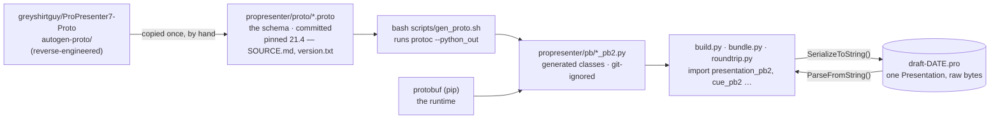
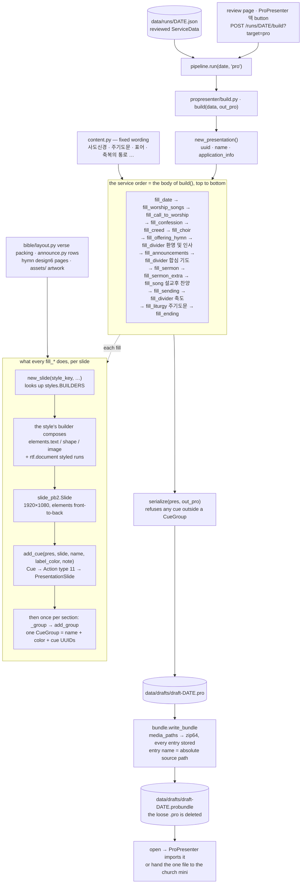
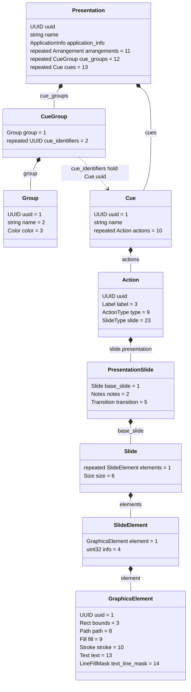

# ProPresenter (`.pro`) generation — how it works now

The current-state guide to the ProPresenter build path: what the protobuf pieces are, how a
reviewed week becomes a `.probundle`, and what a `.pro` looks like inside. **Why** each decision
was made — and every alternative that was built and rejected — lives in the decision log,
[`propresenter-generator-design.md`](propresenter-generator-design.md). Read this first; go there
when you need the reasoning.

For the whole service — both build targets, phone to projector — see the README's
[Architecture](../README.md#architecture).

## Proto vs. protobuf — the one-screen version

A `.pro` file is not a format we designed, and not a zip of XML. It is **one Protocol Buffers
message, written in binary**. Everything else on this page is plumbing around that fact.

| term | what it is | where it lives here |
|---|---|---|
| **Protocol Buffers** ("protobuf") | Google's binary serialization format, plus the schema language that describes it | the `.pro` file format itself |
| **`.proto` file** | a *schema*: named messages with numbered, typed fields (`repeated Cue cues = 13;`). Plain text, no code | `src/worship_deck/propresenter/proto/*.proto` — **committed** |
| **`rv.data`** | the package name inside those schemas (Renewed Vision, ProPresenter's maker) | `rv.data.Presentation`, `rv.data.Cue`, … |
| **`protoc`** | the protobuf *compiler*: reads `.proto` files, writes code in a target language | `brew install protobuf`; run for you by `scripts/gen_proto.sh` |
| **`*_pb2.py`** | protoc's Python output — one module of generated classes per `.proto` (`presentation_pb2.Presentation`) | `src/worship_deck/propresenter/pb/` — **generated, git-ignored** |
| **`protobuf`** (pip) | the Python runtime those classes run on: `SerializeToString()` / `ParseFromString()` | `pyproject.toml` dependency |
| **a `.pro`** | exactly one serialized `rv.data.Presentation` — raw bytes, no container | `build.serialize` writes it, `build.load` reads it |

In one sentence: **`.proto` is the blueprint, `protoc` turns the blueprint into `*_pb2.py`
classes, and the `protobuf` runtime turns a filled-in `Presentation` object into the bytes of a
`.pro`** (and back).

Four things follow from that table:

- **Our schema is unofficial.** Renewed Vision publishes no `.proto` files. The ones in `proto/`
  were reverse-engineered by
  [greyshirtguy/ProPresenter7-Proto](https://github.com/greyshirtguy/ProPresenter7-Proto), copied
  in once, and pinned to **ProPresenter 21.4** (`proto/SOURCE.md`, `proto/version.txt`). Field
  *names* are that project's best guess; nothing checks them against the app.
- **Only field *numbers* go on the wire.** The bytes say "field 13, a length, then bytes" — never
  "cues". That is why a pin matters at all (a release could renumber a field), and why a deck
  serialized against the 21.4 schema opens on the church's 18.4: the numbers it uses are the same
  in both (#191 — see [Compatibility & deployment](#compatibility--deployment)). A field the reader
  doesn't know is skipped, not an error.
- **Generated code isn't committed.** `pb/*_pb2.py` is derived from `proto/`, so it is git-ignored
  like any build output. Run `bash scripts/gen_proto.sh` after a fresh checkout **and in every new
  worktree**. Without it every `propresenter` test `importorskip`s away and the suite reads green
  without testing anything — which is also what CI does, since it never generates bindings.
- **Nothing downstream needs protoc.** Bindings are generated on the dev Mac. The `.probundle`
  handed to the church mini is just data: the mini needs no protoc, no Python, no repo.

### How the generated modules are imported

protoc's Python output imports its siblings by bare name (`import cue_pb2`), which only resolves if
`pb/` itself is on `sys.path`. `pb/__init__.py` does exactly that as an import side effect, so every
consumer starts with:

```python
# isort: off
from . import pb  # noqa: F401 -- side effect: puts pb/ on sys.path for the bare *_pb2 imports

import cue_pb2
import presentation_pb2
# isort: on
```

The `# isort: off` fence is load-bearing: if ruff/isort sorts `from . import pb` below the `*_pb2`
imports, the module fails to import.

And because `pb/` is empty on CI, `pipeline.run` imports `propresenter` **inside** its
`target == "pro"` branch, never at module scope — a top-level import would break every pipeline and
web-app test on Ubuntu.

## Diagram A — the toolchain (dev Mac only)



Re-vendoring (a new `proto/` snapshot + `gen_proto.sh`) is only needed if a future ProPresenter
release fails to open a generated deck. The steps are in `proto/SOURCE.md`.

## Diagram B — from a reviewed week to a `.probundle`



- **Weekly vs fixed.** Weekly sections come from `ServiceData` and are skipped when empty. The
  fixed-wording sections (`content.py`) always emit, because a ground-up deck has no template for
  them to ride along in the way `master.key`'s untouched slides do.
- **Nothing shifts.** Each `fill_*` *appends* its cues and one group, so unlike the Keynote builder
  there is no landmark detection and no back-to-front index arithmetic. To reorder the service, you
  reorder the calls in `build()`.
- **Timing.** The whole serialize takes about 2s. `build()` returns per-section step timings that
  `obs.run_record` logs under phase `build_pro`.

## Diagram C — what's inside a `.pro`

Only the messages and fields the generator actually uses. Field numbers are from the vendored
protos.



How to read it:

- **Sections are groups.** A `CueGroup` (a colored bar in ProPresenter) holds its `Group` (name +
  color) and a list of cue UUIDs. Cues live flat in `Presentation.cues`, and groups point at them.
  ProPresenter renders the *groups*, so a cue in no group never appears. `serialize` refuses such a
  deck.
- **A slide is four wrappers deep:** `Cue` → `Action` → `PresentationSlide` → `Slide`. The
  action's `type` must be set to `ACTION_TYPE_PRESENTATION_SLIDE` (11). Setting only the `slide`
  oneof isn't enough.
- **The grid caption is `Action.label`**, not `Cue.name`: PP doesn't show the cue name in the grid.
  Song cues carry their V1/C/B section this way (design doc, Decision 4).
- **`PresentationSlide.notes`** is the booth-facing notes pane, used for the 성가대 lighting cue.
- **The canvas size is per slide** (`Slide.size` = 1920×1080). There is none at document level.
- **`elements[0]` is the topmost layer.** The backdrop comes last. The style builders compose
  back-to-front and reverse the list on the way out.
- **Each element is a `GraphicsElement`:**
  - `bounds` is the box.
  - `path` is always a unit-square rectangle.
  - `fill` is a solid color or media. An image is a percent-encoded `file://` URL, and that is
    what `bundle.media_paths` collects.
  - `text.rtf_data` is the styled text as RTF (Korean as signed 16-bit `\uN` escapes), with
    `text.attributes` repeating the same font, color and alignment.
  - `text_line_mask` gives the per-line black strip on lyric slides.
  - `SlideElement.info` is a bitmask: 3 for text, 1 for shapes.
- **Never written:** `Presentation.arrangements`, `PresentationSlide.transition`, the deck-level
  `Presentation.transition`, and `Fill.backgroundEffect`. See [Gotchas](#gotchas).

## Module map

| file | role |
|---|---|
| `propresenter/build.py` | `build()` — the service-order walk; one `fill_*` per section; the protobuf primitives `new_presentation`, `new_slide`, `add_cue`, `add_group`, `place_image`, `serialize`, `load` (`add_arrangement` is kept but unused) |
| `propresenter/styles.py` | the look, as code: palette, geometry, fonts, authoring-time text fitting, and one builder per `STYLE_KEYS` entry (dispatched through `BUILDERS`) |
| `propresenter/elements.py` | element factories — `text`, `shape`, `image`, `line_strip`, `web`, `shadow` — plus `new_uuid` and `set_color` |
| `propresenter/rtf.py` | `escape` / `document` / `plain` — styled RTF runs, Korean included |
| `propresenter/content.py` | fixed wording read off `master.key`: `DIVIDER_LABELS`, both 사도신경 forms, `LORDS_PRAYER`, `SENDING_SONG`, the 표어/환영/폐회 cards, slide notes |
| `propresenter/announce.py` | splits a 교회 소식 item into a title plus 날짜/시간/장소/문의 rows for the 라벨 레일 plate |
| `propresenter/bundle.py` | `media_paths` + `write_bundle` — the `.pro` plus its media as one `.probundle` |
| `propresenter/roundtrip.py` | the #165 hello-world read → mutate → write proof; not used by the build |
| `propresenter/assets/` | church logo, two pre-service photos, `backdrops/` (pre-blurred 네이비 프레임 grounds); `m1-angled-bar.png` and `brush-stroke-purple.png` survive only for the #241 style review |
| `propresenter/proto/` · `pb/` | the schema (committed) · the generated bindings (git-ignored) |
| `pipeline.run(date, target)` | picks the builder; for `pro`, builds, bundles, deletes the loose `.pro` |
| `hymn.py` | `PRO_DESIGN = "design6"` — the .pro's 봉헌 pages, fetched beside Keynote's `no-bg` and swapped in by filename |
| `bible/layout.py` | verse packing shared with the Keynote builder; the `.pro` passes its own line-pitch ratios |
| `scripts/gen_proto.sh` | `proto/` → `pb/` |
| `scripts/make_pro_demo.py` | one cue per style key; `--run YYYY-MM-DD [--bundle]` builds the real weekly deck; `--candidates` / `--fonts` / `--font` for the #241 review |
| `scripts/audit_pro_layout.py` | measures every text box of a `.pro` through CoreText (`measure_text.swift`) — a clean run means the deck fits |
| `scripts/measure_advance.swift` | a font's three layout metrics (Hangul advance, Latin advance, line pitch) |
| `scripts/make_backdrop.py` | bakes the pre-blurred backdrops (`--all` for every strength) |
| `scripts/render_style_samples.py` | the #189 PNG style mock-ups — historical reference |

## Compatibility & deployment

- **Pinned to 21.4, verified on 18.4.** The vendored schema is PP 21.4 (build 352583705), which is
  what the dev Mac runs (18.4 crashes on it). On 2026-09-09 a real weekly deck — 165 slides in 20
  groups — was imported into the church mini's **18.4** (302252046) and rendered correctly:
  - groups, group colors and slide labels
  - Korean RTF and the 개역한글/ESV verse layout
  - the 봉헌 hymn pages and the backdrops

  Diffing its bytes against the copy 18.4 wrote back showed four differing field paths, none of
  them content (table in `proto/SOURCE.md`). **The pin stays** (#191).
- **`build.PP_VERSION` = (21, 4)** stamps `application_info`. That is a truthful record of the
  schema the file was written with, and 18.4 restamps it on open.
- **The church mini needs three things, all one-time:**
  1. **NanumSquare Round installed** (README → "Presentation machine").
  2. **The Glossa translation Prop** — machine-local, never in the deck (#177).
  3. **ProPresenter's global transition set to Cut** — generated decks carry none (#174).

  Mini #1 has the first two as of 2026-09-09.

## Gotchas

Each of these cost a debugging round. The full story is in the design doc.

- **Never write a transition.** PP 21.4 silently drops every slide that carries a
  `PresentationSlide.transition` it can't resolve. A deck-level `Presentation.transition` makes the
  whole document unreadable. Worship uses PP's global cut transition (#174).
- **Never use `Fill.backgroundEffect` (background blur).** It crashes PP when the slide is
  selected. The 네이비 프레임 backdrops are pre-blurred images instead (#224).
- **Never use `SCALE_BEHAVIOR_SCALE_FONT_DOWN`.** PP shrinks the text until it fits *without
  wrapping*, so a four-line verse became one ~20pt line. Fitting is baked in at authoring time
  (`styles._fit_scale`).
- **No arrangements.** PP groups don't nest, so song sections as groups turned 5 bars into 18
  (#176). Sections are slide labels instead.
- **Every cue in a group.** Otherwise the cue is invisible. `serialize` enforces this.
- **Keying.** Sung lyrics, song banners and the blank separators are backed with
  `styles.CHROMA_GREEN` (`#81D654`, #192), so the ATEM keys them over the live camera. Full-screen
  sections are opaque navy.
- **Fonts substitute silently.** A missing face looks like a style bug. A new face means a
  church-mini install plus three measured constants (`scripts/measure_advance.swift`), then an
  `audit_pro_layout.py` run over several real weeks.
- **PP caches a `.pro` it has already read.** Overwriting a file in place keeps serving the old
  slides, so write a new filename each iteration.
- **Build handoff bundles from the main checkout, not a worktree.** Bundle entry names are the
  media's absolute source paths. When a deck built under `.claude/worktrees/…` was imported, PP
  silently skipped exactly the media whose path went through that hidden directory (found during
  #191; not yet fixed).
- **Worktrees:** run `gen_proto.sh` there too, and prefix pytest with `PYTHONPATH=src` (see
  `docs/gotchas.md`).
- **Glossa is a Prop, not a slide.** The generator writes nothing for it (#177).
- **To change the look, read a markup.** Have the operator hand-restyle a generated `.pro`, then
  read the exact numbers back out of it (#178 round 3). That beats any description. Re-run the
  audit afterwards.

## Checking your work

```bash
bash scripts/gen_proto.sh                                     # once per checkout / worktree
ruff check src/worship_deck/propresenter tests/test_propresenter_*.py
pytest -m "not local_only" tests/test_propresenter_build.py tests/test_propresenter_bundle.py
pytest -m local_only tests/test_propresenter_build.py         # Cocoa RTF re-parse (textutil)
python scripts/make_pro_demo.py --run 2026-08-30 --bundle     # the real weekly deck + .probundle
python scripts/audit_pro_layout.py data/drafts/draft-2026-08-30.pro   # does every box fit?
```

To see what ProPresenter actually renders, enable *Preferences → Network* and pull rendered slide
JPEGs from its local HTTP API. The recipe is in the design doc under "Seeing what ProPresenter
actually renders". An empty `groups[].slides[]` there means PP rejected the slides.
