# Lyric-slide style references (#167)

Phase 1 design deliverable for the ProPresenter migration (epic #184). Collects
lyric-slide references for the worship team to react to, captured along five
dimensions, and sets them side by side with our current `.key` deck. **This doc
gates the style-direction decision (#168) and the bilingual / Glossa-layout
decision (#169)** — it does not itself decide anything.

> **Screenshots are captured.** `docs/style-references/` holds: live-stream lyric
> frames for all 10 influential churches (from Renewed Vision's analysis), four
> slides exported from our own `master.key`, modern scripture-slide designs (§3),
> and — most relevant — **frames grabbed from full-service YouTube replays** of
> **Life.Church** and of three **Korean-American** churches that span our spectrum
> (§4): **KCPC** (large, traditional, fully bilingual — our closest structural
> twin, with a real reference for *every* liturgical section), **IN2 (Onnuri) NY**
> (young, bilingual), and **Kairos** (young, English-only). The Korean-American
> captures are the centerpiece: they answer the bilingual question (#169) with
> real precedents, which the English-only megachurches cannot. Swap in better
> frames anytime — the doc just references files.

The five capture dimensions (from the issue): **font · contrast · lines-per-slide
· full-screen vs lower-third · bilingual treatment.**

---

## 1. The reference set

### 1.1 Renewed Vision — "Lower Third Lyrics From 10 Influential Churches"

Renewed Vision (the maker of ProPresenter) polled its users' group for the
churches most respected for live production, then analyzed each one's
lower-third lyrics and shipped a matching ProPresenter Theme. This is the single
most useful reference because it is (a) ProPresenter-native, (b) measured
consistently, and (c) the source of the "10 influential churches" the issue
names.
[Blog post + downloadable Themes.](https://www.renewedvision.com/blog/lower-third-lyrics-from-10-influential-churches)

| Church | Typeface | Lines | Caps | Text | Background | Format |
|---|---|---|---|---|---|---|
| Bethel | Futura PT (Book) | 2 | ALL CAPS | White | none | Lower third |
| Elevation | Helvetica Neue (Medium) | 2 | ALL CAPS | White | none | Lower third |
| Gateway | DINosaur (Medium) | 1 | ALL CAPS | White | none | Lower third |
| Hillsong | Titling Gothic FB Wide | 2 | ALL CAPS | White | none | Lower third |
| Life Church (UK) | Bely (Bold) | 2 | ALL CAPS | White | none | Lower third |
| Life.Church (USA) | Charter (Bold) | 2 | ALL CAPS | White | none | Lower third |
| Passion City | PT Sans (Bold Italic) | 2 | ALL CAPS | White | none | Lower third |
| Red Rocks | Avenir Next (Regular) | 1 | ALL CAPS | White | none | Lower third |
| Transformation | Helvetica Neue (Medium) | 2 | ALL CAPS | White | none | Lower third |
| UPPERROOM Dallas | Helvetica Neue (Medium) | 1 | ALL CAPS | White | none | Lower third |

**Summary findings (their words):**
- **Lines:** nobody uses 3 lines. Max 2 for most; three churches use only 1.
- **Font:** sans-serif dominates (Helvetica Neue is the single most common, 3×).
- **Caps:** ALL CAPS far more common than Title Case — gives consistent
  line-height and removes "is this word capitalized?" ambiguity.
- **Background:** plain white text, no fill, for most. Two use a black bar fill;
  one uses shadow + outline.
- **Size:** on a 1920×1080 frame with Helvetica, sizes run 35–62 pt, ~46 avg.
- **Resolution:** mostly 1080p (Life.Church 4K, Gateway 720p).

### 1.2 The reference frames

The three the issue calls out first:

| Hillsong | Elevation | Life.Church (USA) |
|---|---|---|
| 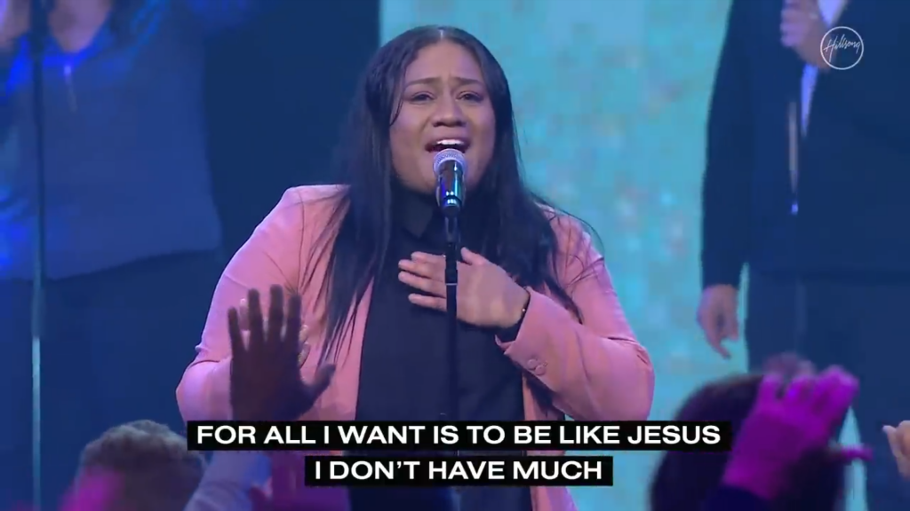 | 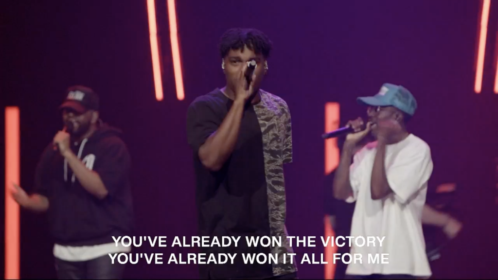 | 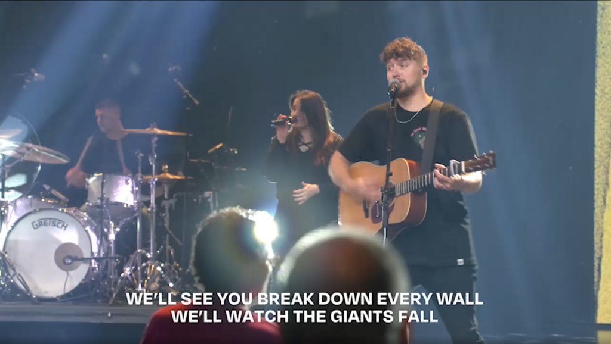 |
| Titling Gothic, 2 lines, ALL CAPS, white | Helvetica Neue, 2 lines, ALL CAPS, white | Charter Bold, 2 lines, ALL CAPS, white |

The rest of the set:

| Bethel | Gateway | Passion City |
|---|---|---|
| 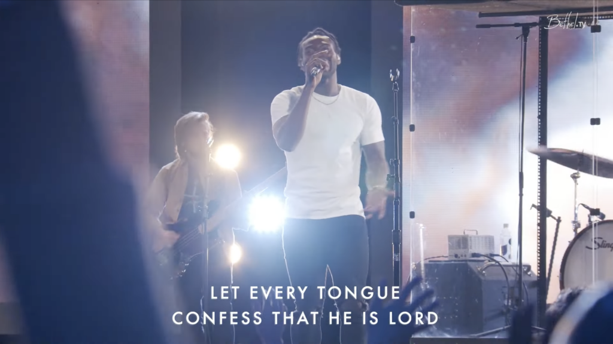 | 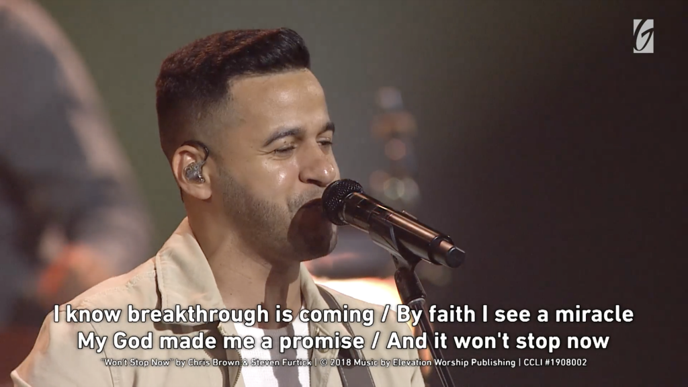 | 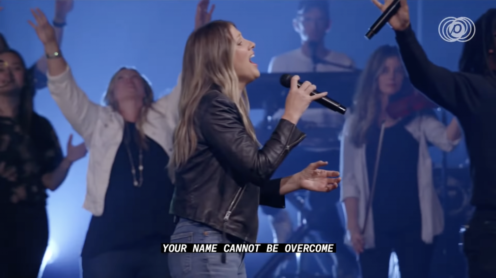 |

| Red Rocks | Transformation | UPPERROOM | Life Church (UK) |
|---|---|---|---|
| 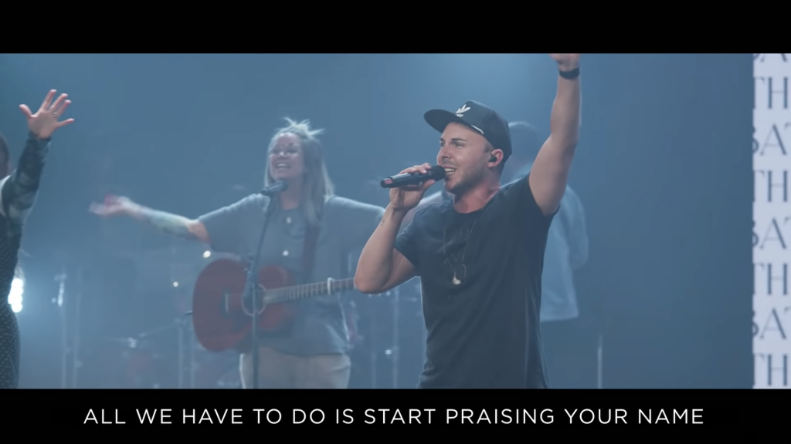 | 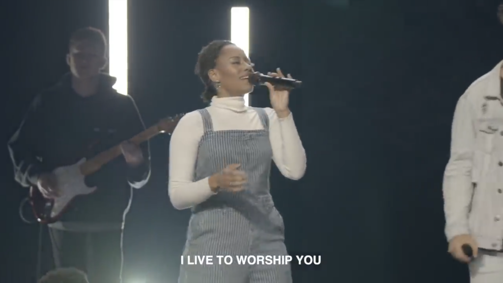 | 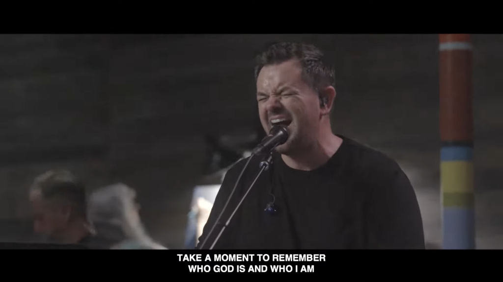 | 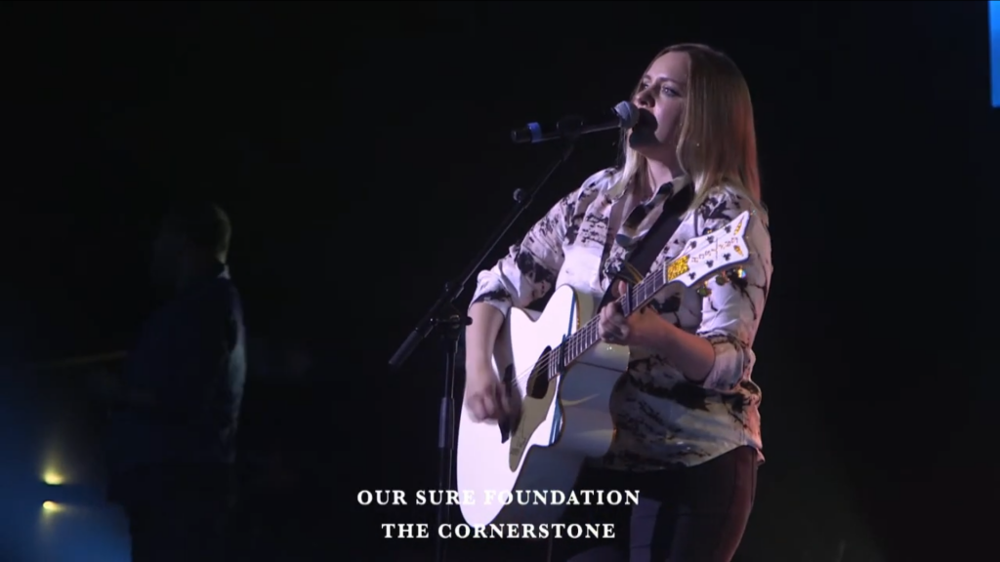 |

What jumps out across all ten: the lyric band sits in the **lower third over a
live shot of the room/stage**, never on a designed background plate. White text,
no box (or a barely-there scrim), tight tracking, big and confident. The
production *is* the camera; the slide is just type.

A fresh frame I grabbed from a **2026 Life.Church** service replay confirms the
look still holds — white ALL-CAPS, 2 lines, no box, over the worship-leader shot:

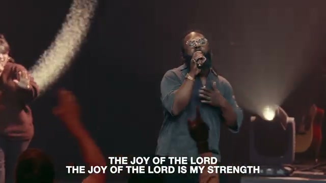

---

## 2. Our current deck (`.key`), side by side

So the comparison is honest: our deck is **not** an English single-language
stream overlay, and that changes what transplants. Two distinct treatments live
in today's deck (see `config/slide_map.yaml`):

- **Worship-song & confession lyrics → green chroma-key *lower-third* banners.**
  These are keyed out over the live camera feed: a narrow title banner + wide
  ≤2-line lyric banners. So we are *already* in the lower-third world for sung
  lyrics, and already at ≤2 lines — closer to the reference set than expected.
- **Bible verses, liturgy (사도신경/주기도문), announcements → *full-screen*
  native text**, packed to a measured fill ratio with deliberate label/KO/EN
  gaps (see the slide-density notes). Verses are bilingual: 개역한글 Korean
  stacked with ESV English.

Slides exported from our own `master.key`:

| Worship-song lyric | Bible verse (KO / EN) |
|---|---|
|  | 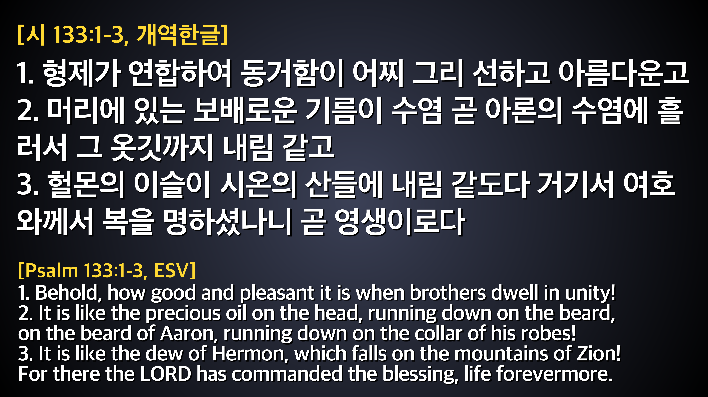 |
| Navy lower-third banner over **green chroma key** (composited onto the live camera), white text, ≤2 Korean lines. Already lower-third, already ≤2 lines. | Full-screen: `[시 133:1-3, 개역한글]` numbered Korean **stacked over** `[Psalm 133:1-3, ESV]` English. This is our existing bilingual answer — stacked, not overlaid. |

| Section divider | Liturgy (사도신경) |
|---|---|
| 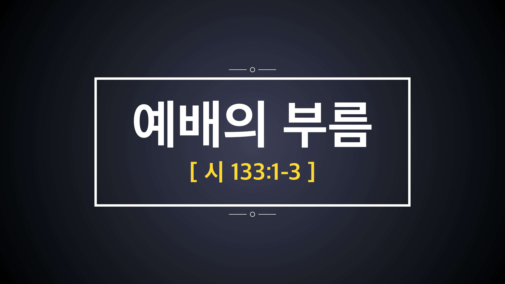 | 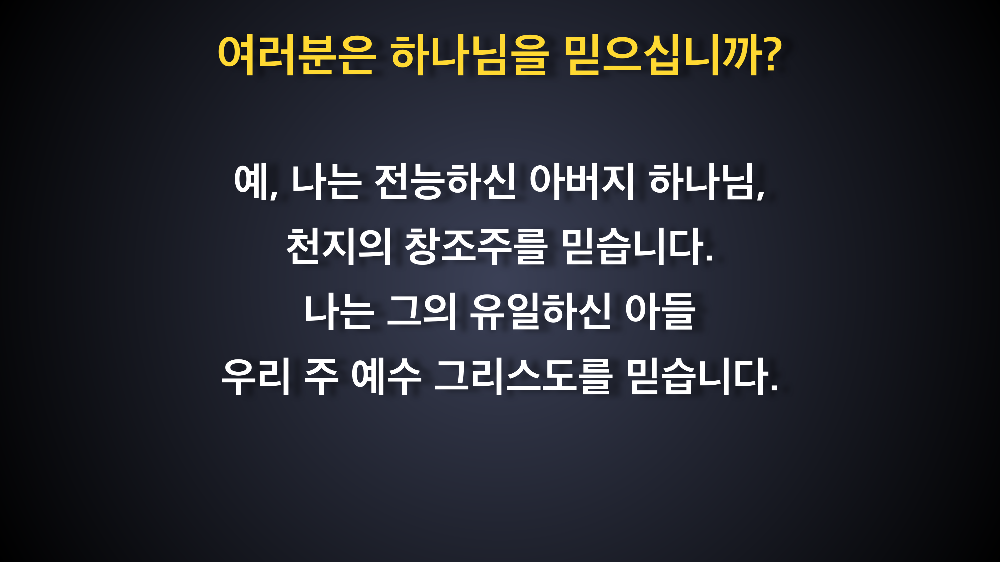 |
| Full-screen heading in a thin framed box, yellow reference label, subtle dark gradient. | Full-screen: yellow question header + centered white body, packed but with breathing room. |

Read side by side, the gap is clear: the influential-church look is **camera +
minimal type**; ours is **designed full-screen plates** (plus a green-screen
lower-third for sung lyrics). The migration question is how far toward the former
we want to move — and the bilingual + Glossa requirements (§6) keep us from going
all the way there. **IN2 NY (§4) shows a Korean church that made exactly this
move while staying bilingual.**

---

## 3. The other service sections (verse / divider / announcement / liturgy)

The song lower-thirds are well covered above. For the *rest* of our service —
Bible verse, section dividers, announcements, liturgy — the honest finding is
**structural, not just stylistic**:

> The "10 influential churches" are **non-liturgical contemporary** churches.
> Their broadcast is a continuous camera shot with lyric/scripture lower-thirds.
> They have **no creed slide, no Lord's-Prayer slide, and no Korean-style section
> divider** (예배의 부름 / 사도신경 / 봉헌). So *among the English megachurches*
> there is no like-for-like reference to copy — the comparison result *is* "they
> don't do this." **But KCPC (§4.2) does** — a large Korean-Presbyterian church
> with the same liturgy, giving us real bilingual references for the creed, choir,
> scripture, offering, and announcements. So for those sections, look to §4.2, not
> to §1.

What *does* have a clean reference is the **Bible verse** slide. Authentic
full-screen scripture frames from a specific church's broadcast aren't cleanly
downloadable, so these are representative **modern scripture-slide designs** (from
Church Motion Graphics) that show the prevailing look — useful to hold next to our
verse slide:

| Centered, boxed reference | Centered caps, version label |
|---|---|
| 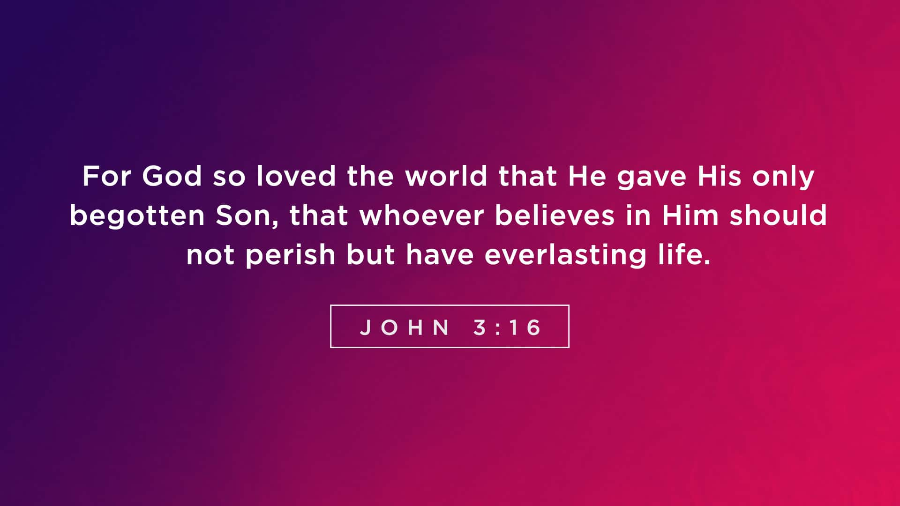 | 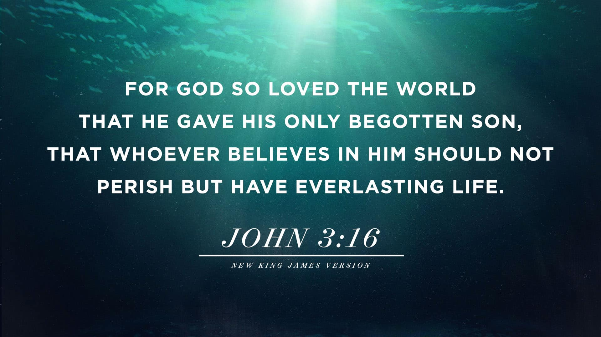 |
| Gotham, mixed case, 2–3 lines, reference in a thin box. | All-caps body, serif reference + translation note, photo background. |

Side by side with **our** verse slide (`current-verse.png`): the modern examples
show **one language, one passage, generous negative space**; ours carries
**six lines of Korean + six of English in one frame** plus two reference labels.
That density is the real tension to resolve for #169 — the modern look assumes
breathing room our bilingual requirement spends on a second language.

**Sermon title / divider.** The nearest contemporary equivalent to our section
dividers is the **sermon-series title graphic** (custom art per series). That's a
per-week design effort these churches' media teams do by hand — not something a
generator produces, and not a model for our fixed liturgical dividers (예배의 부름
etc.), which want a consistent, generated template, not bespoke series art.

**Announcements.** Same story: contemporary announcements are bespoke per-event
motion graphics, not a generated text template. Our announcements come from the
bulletin as text, so the relevant reference is a clean text-on-background layout,
not the churches' branded event slides.

> **For authentic stills of these sections**, the reliable source is the churches'
> **YouTube full-service replays**. I pulled frames this way for **Life.Church**
> (above) and **IN2 NY** (§4) — point me at any other service video and I'll grab
> more.

---

## 4. Korean-American reference churches

The English megachurches (§1) tell us the *contemporary look*; they can't tell us
how a **Korean-American** church handles a bilingual, liturgical service. So I
pulled full-service YouTube replays from three Korean-American churches that span
the actual spectrum our team sits on:

| | Church | Generation / language | Structure | Bilingual display |
|---|---|---|---|---|
| §4.1 | **IN2 (Onnuri) NY** | Young adults, bilingual | Contemporary | **KO over EN**, mostly lower-third |
| §4.2 | **KCPC (Centreville, VA)** | Large, multi-gen, Korean-first | **Liturgical** (creed, choir, offering) | **KO over EN**, everywhere |
| §4.3 | **Kairos (San Diego)** | Young, English-only | Contemporary | **English only** |

The read across the three: **KCPC is our closest structural twin** — a big
Korean-Presbyterian church that runs the same liturgy we do (Apostles' Creed,
choir anthem, offering, announcements) and renders *every* section **Korean-over-
English**. **IN2** shows the same bilingual instinct in a young contemporary
package. **Kairos** is the cautionary/clarifying end point: a young Korean-
American church that has gone **English-only** looks indistinguishable from
Life.Church (§1). Bilingual is a choice these churches make by generation, and
the two that keep Korean both stack it **on top**.

### 4.1 IN2 (Onnuri) New York — young, bilingual

This is the most directly applicable reference in the whole doc. **IN2** is a
[vision church planted in 2005 by Onnuri Community Church](https://in2.onnuri.or.kr/)
to reach young Korean-Americans in midtown Manhattan (the name = "come **IN**to
Jesus" / "go **IN**to the world"). Like us it is **Korean-Presbyterian-rooted and
bilingual**: Korean services plus a 12:30 English service, with sub-ministries
WIN2 (young adults — the service sampled here), M2 (college), and Crosswalk /
RLVNT (English ministry). It sits in the wider Onnuri vision-church family (LA,
Irvine, San Jose, NJ). So unlike the English megachurches, IN2 has *already
solved the exact problem #169 poses* — and they solved it with **Korean stacked
over English**.

Frames from their **2026-06-21 WIN2 Sunday service** ([replay](https://www.youtube.com/watch?v=LGOAZOjfDgM)),
section by section:

**Worship lyric — bilingual lower-third.** Korean line over a smaller English
line, white, no box, over the live worship shot. This is our `current-song-lyric`
treatment minus the green-screen, plus an English line.

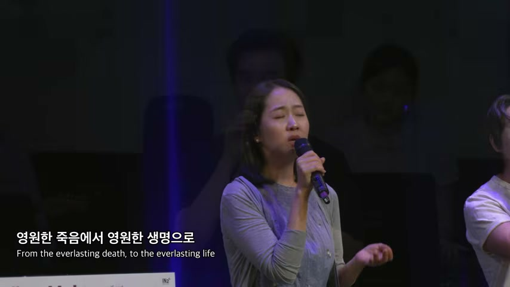

**Sermon scripture — bilingual lower-third.** During the sermon the read verse
appears as `창 1:3 | …` (Korean) over `Genesis 1:3 | …` (English) — reference +
text, both languages, one band, over the preacher. **This is the single most
useful frame for #169**: it shows bilingual scripture working as a lower-third,
not a full plate.

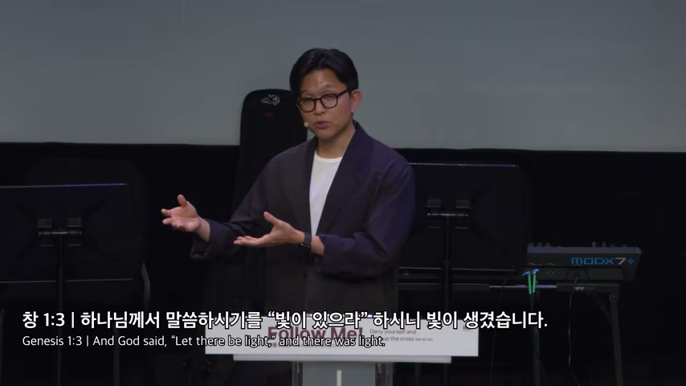

**Scripture — full-screen.** For the responsive/communal reading (공동체 성경읽기)
they switch to a full-screen plate: dark rounded frame, book/chapter label
top-left, numbered verse lines centered. Compare directly to our `current-verse`
— same full-screen instinct, cleaner frame, but here Korean-only (the bilingual
pairing lives on the lower-third instead).

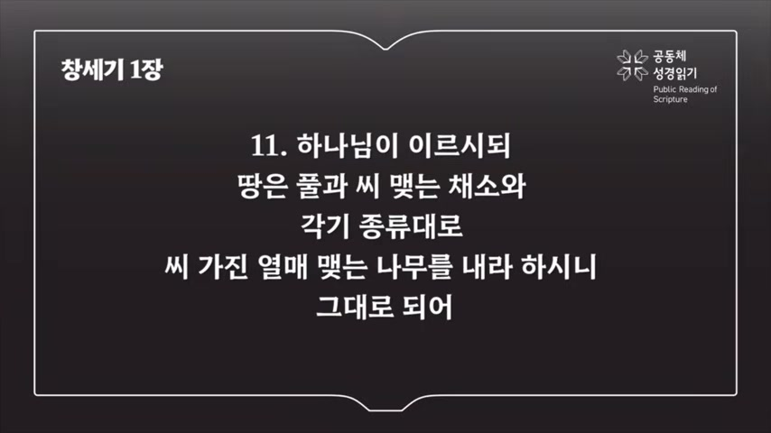

**Announcement — bilingual designed slide.** Full-screen event graphic with a
photo, QR code, and KO/EN details (`IN2 Brooklyn Seed Member 모집`). Title mixes a
Latin display face with Hangul; body stacks Korean labels with English specifics.
This is the modern bilingual announcement we lack.

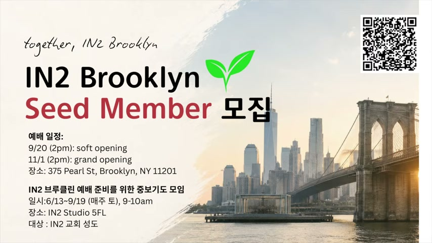

**Pre-service — countdown + house rules.** A branded countdown timer over four
guideline cards (no food/drink, no pets, arrive on time, fill front-center seats)
— clean card UI, IN2/WIN2 logos. We have no equivalent; worth considering.

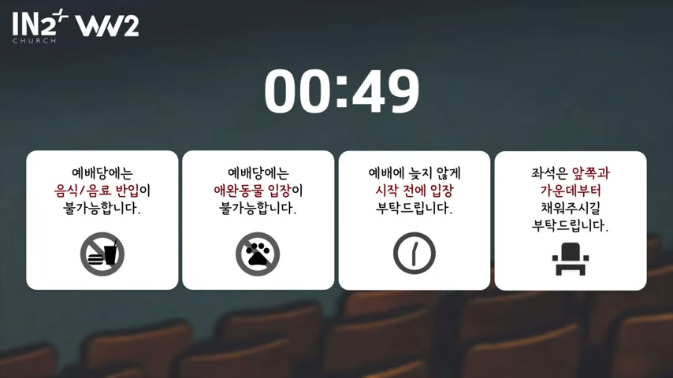

**What IN2 settles for us:**
- **Bilingual is KO-over-EN, Korean dominant** (larger/top), English secondary
  (smaller/below) — consistently, across worship *and* scripture.
- **Lower-third vs full-screen is per-moment, not global:** bilingual pairing on
  the **lower-third** (worship, sermon verse) over live camera; **full-screen**
  reserved for communal scripture reading. That matches the per-section call §5
  flags for us.
- The look is **white sans-serif, generous, no heavy boxes** — same family as the
  influential churches, but proving it works *with* a second language.

### 4.2 KCPC (와싱톤중앙장로교회) — large, traditional, fully bilingual

**This is our closest structural match.** Korean Central Presbyterian Church
(Centreville, VA; ~5,400 members) is a large, multi-generation Korean-Presbyterian
church that runs **the same liturgy we do** — and renders essentially *every*
section **Korean-over-English**. Where IN2 shows the young-contemporary version,
KCPC shows the full liturgical version, which is what our deck actually is.
Frames from their **2026-06-28 Sunday service** ([replay](https://www.youtube.com/watch?v=7bHQYFnZKbg)):

**Worship lyric — bilingual lower-third.** Korean line over a smaller English line,
white, no box, over the live worship shot — the same KO-over-EN lower-third IN2
uses.

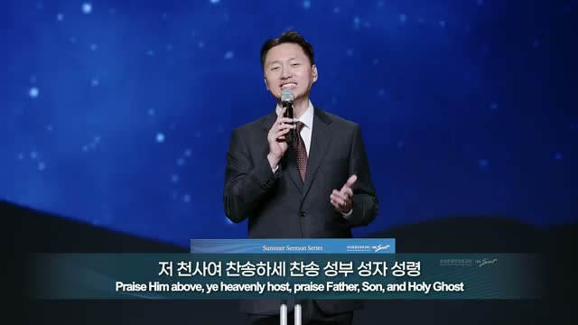

**Apostles' Creed (사도신경) — bilingual full-screen.** This is the frame we had
*no* reference for before: a full-screen creed plate, Korean stanza over the
English (`I believe in the Holy Spirit, the holy universal church … Amen`),
centered, white on dark. Direct like-for-like with our `current-creed` slide —
and it confirms the liturgical sections *do* have a real bilingual precedent once
you look at a Korean church instead of the English megachurches.

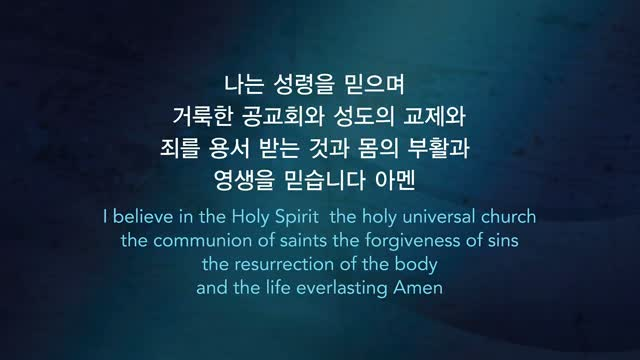

**Scripture — bilingual full-screen.** Reference header (`갈라디아서 Galatians 2:20`),
Korean body with one **red emphasis line**, English below. This is almost exactly
our `current-verse` layout — reference label + KO stacked over EN — but cleaner,
and it uses color to mark the key line. The most useful KCPC frame for #169.

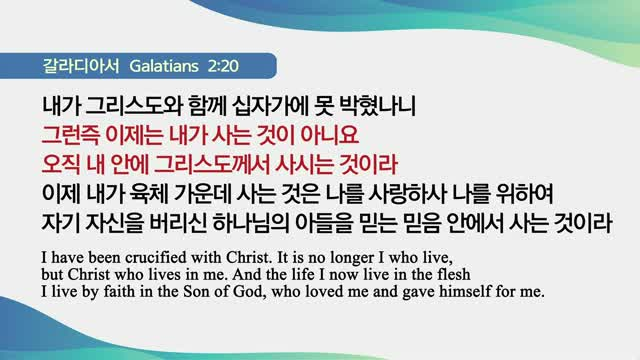

**Choir (성가대) & announcements.** They also have the two sections the English
churches lack: a **choir anthem** title card (`Soli Deo Gloria (오직 주께 영광)` +
choir name) and full-screen **news/event graphics** (KCPC NEWS). Both are template
slides, not bespoke motion graphics — the achievable bar for our generator.

| Choir anthem card | Announcement (KCPC NEWS) |
|---|---|
| 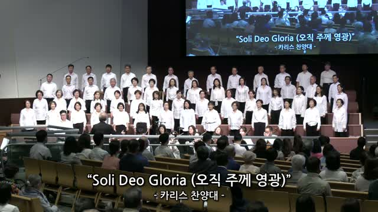 | 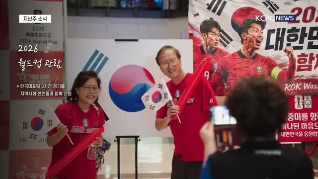 |

**What KCPC settles for us:** the *entire* liturgical service — creed, scripture,
choir, offering, announcements — has a working bilingual reference, and it lands
the same place IN2 does: **Korean on top, English below.** Liturgy full-screen,
sung lyrics lower-third — the same per-section split §5 flags.

### 4.3 Kairos (San Diego) — young, English-only

The counter-example, and useful precisely because it's Korean-American too.
Kairos is a young Korean-American church (part of the AMI network) whose service
is **entirely English**. Frames from their **2026-06-28 service**
([replay](https://www.youtube.com/watch?v=ps4Azlq_d64)):

| Worship (English lower-third) | Sermon scripture (English full-screen) |
|---|---|
| 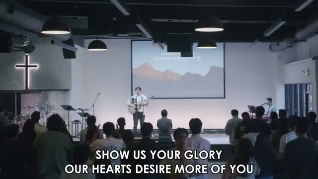 | 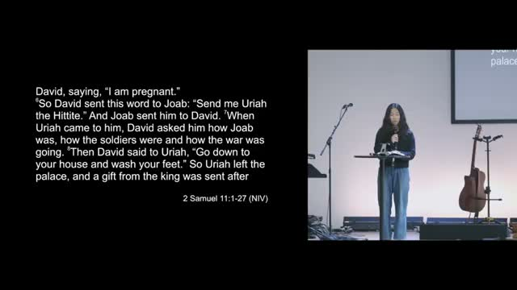 |
| White, ALL CAPS, 2 lines, no box — identical to Life.Church (§1). | Full-screen NIV passage, white on dark, reference bottom-right. |

| Sermon-series title | Announcement (event graphic) |
|---|---|
| 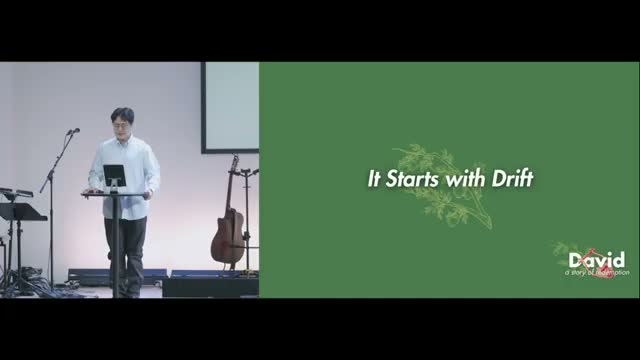 | 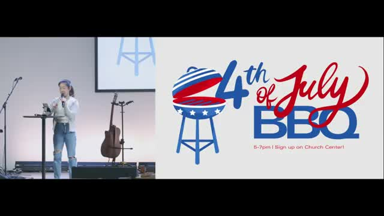 |
| Bespoke series art (`It Starts with Drift`) — per-week design, not generated. | Branded event slide (`4th of July BBQ`) — motion graphic, not a text template. |

**What Kairos settles for us:** it's the null result that sharpens the choice. A
Korean-American church that drops Korean converges *exactly* on the §1 look — no
creed, no divider, English-only lower-thirds, bespoke sermon/announcement art.
The design tension in this whole doc (density, second language, liturgy) exists
**only because we keep Korean and keep the liturgy**. That's a deliberate
identity choice, and KCPC (§4.2) — not Kairos — is the church we're actually like.

---

## 5. Dimension-by-dimension read

**Font.** The reference set is unanimously sans-serif. None of their typefaces
ship a Hangul set, so they don't transfer directly — but the *category* does.
The migration shortlist (#168) is already Hangul-strong sans: **Pretendard /
Noto Sans KR / SUIT**, optionally paired with a Latin face (Montserrat / Gotham /
Helvetica Neue) for the English line. Pretendard is the natural default — it's a
modern Hangul-first sans designed to pair with a Helvetica-like Latin set, so the
KO and EN lines stay visually consistent.

**Contrast.** Universal white-on-dark. Matches the migration default already
noted for #168. No reference argues for anything else; this is the cheap, safe
pick. (Our keyed green banners are a chroma artifact, not a design choice — they
disappear once we're compositing in ProPresenter rather than green-screen
keying.)

**Lines per slide.** The reference ceiling is 2; ours is already ≤2 for sung
lyrics. The wrinkle is **bilingual** — see §6. If Korean and English each get
their own lines, "2 lines" effectively means *2 Korean + their English*, which
is a different real-estate problem than a single-language 2-liner.

**Full-screen vs lower-third.** The references are *all* lower-third because they
exist to overlay a **live-stream** camera feed. Our deck splits the difference:
lower-third for sung lyrics, full-screen for verses/liturgy. ProPresenter lets us
keep that split *without* the green-screen hack. The real driver for #168 is the
**dual-screen plan** (see the dual-screen Glossa/ProPresenter note) — during the
sermon the two stage screens diverge (camera + KO/EN verse on one, Glossa on the
other), so verse slides may need to live as a lower-third over camera, not only
as full-screen. Flag this for the team: "full-screen vs lower-third" may not be
one global answer but per-section.

**Bilingual treatment.** None of the 10 influential churches is bilingual — but
**both KCPC and IN2 (§4) are**, and they're our closest precedents. Both stack
**Korean over English**. This is still the dimension with the most to decide;
see §6.

---

## 6. The bilingual question — now with a precedent

The 10 influential churches are single-language English production, so two of
their defaults don't transfer: **ALL CAPS is meaningless for Hangul** (Korean has
no case, so the "consistent line-height" benefit applies only to an English line),
and their **1–2 line lower-third assumes one language** while we need Korean +
English in the same eyeline — plus, for sung lyrics, the live **Glossa iframe**
(the reason for the migration; Glossa gives a web URL ProPresenter embeds in the
slide).

But this is no longer a *gap* — **KCPC and IN2 (§4) are working precedents**, and
they lean the same way on the #169 fork:

- **Stacked, Korean dominant.** Both put **Korean on top (larger), English below
  (smaller)** — IN2 for worship + sermon scripture, KCPC for *everything*
  including the creed and full-screen scripture. Not side-by-side, not
  English-as-afterthought-overlay; a clear vertical hierarchy, agreed on by two
  independent Korean-American churches.
- **Split by moment, not global.** Both keep the bilingual pair on the
  **lower-third** over live camera for sung lyrics, and go **full-screen** for
  read scripture / liturgy. So "stacked" did **not** force full-screen plates
  everywhere — the two-line KO/EN pair fits a lower-third band.
- **Our current verse slides already stack** (개역한글 over ESV), so this direction
  is consistent with what we do and with what both churches prove. KCPC's verse
  slide even adds a **red emphasis line** — a cheap, worth-considering touch.

The remaining open piece is the **Glossa iframe**, which IN2 doesn't have — their
English is a *pre-prepared* translation line, ours is *live-generated* in a web
frame. So #169 still has to decide where the Glossa iframe sits relative to the
KO/EN text (a third element IN2's layout doesn't budget for). Whatever wins gets
baked into the lyric-stanza preset in #170.

---

## 7. What this hands to the decisions

For the worship team meeting, the questions to settle:

- **#168 typeface:** Pretendard vs Noto Sans KR vs SUIT (all Hangul-strong sans,
  consistent with both the influential-church category and IN2's look). Latin
  pairing yes/no.
- **#168 contrast:** confirm white-on-dark (no reference dissents).
- **#168 lines:** confirm ≤2 *Korean* lines — IN2 fits KO + a smaller EN line in a
  lower-third band, so ≤2 Korean lines stays workable bilingual.
- **#168 full-screen vs lower-third:** **per-moment, not global** — KCPC and IN2
  both confirm this: lower-third for worship/sermon verse, full-screen for creed
  and communal reading.
- **#169 bilingual:** **stacked, Korean-dominant** has two real precedents
  (KCPC + IN2, §4) and matches our current verse slides — the live decision left
  is where the **Glossa iframe** sits relative to the KO/EN pair.

What the references settle cleanly: **white, sans-serif, ≤2 lines, no heavy
background.** What the Korean-American churches newly settle: **bilingual =
Korean-over-English, stacked, lower-third for sung/sermon text and full-screen for
liturgy** — with KCPC (§4.2) proving the *whole liturgy* has a bilingual reference,
not just worship. So the only genuinely open piece is fitting the live Glossa
iframe into that layout.

---

_Sources:_
[Renewed Vision — Lower Third Lyrics From 10 Influential Churches](https://www.renewedvision.com/blog/lower-third-lyrics-from-10-influential-churches) ·
[CMG — 7 Popular Typefaces for Worship Lyric Projection](https://www.churchmotiongraphics.com/blog/7-popular-typefaces-for-worship-lyric-projection/) ·
[CMG — 3 Effective Scripture Slide Designs](https://www.churchmotiongraphics.com/blog/3-effective-scripture-slide-designs/) ·
[ProPresenter Themes (ProContent)](https://procontent.renewedvision.com/media/propresenter-themes) ·
[Life.Church service replay](https://www.youtube.com/watch?v=Q-TlPT4tZaY) ·
[IN2 (Onnuri) NY — WIN2 service replay](https://www.youtube.com/watch?v=LGOAZOjfDgM) ·
[IN2 Onnuri Church](https://in2.onnuri.or.kr/) ·
[KCPC (와싱톤중앙장로교회) — Sunday service replay](https://www.youtube.com/watch?v=7bHQYFnZKbg) ·
[KCPC](https://main.kcpc.org/) ·
[Kairos Church (San Diego) — service replay](https://www.youtube.com/watch?v=ps4Azlq_d64) ·
[Kairos Church](https://kairoschurch.org/)
